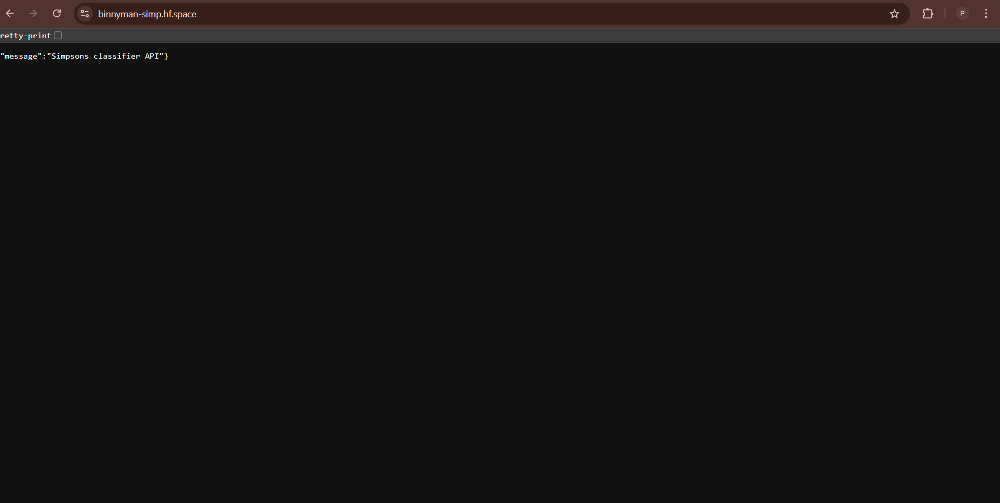

# 🟡 Simpsons Character Classifier

A deep learning project to classify Simpsons characters from images.

It consists of:

* 🎨 **Frontend (Streamlit):** [simpsons-predict.streamlit.app](https://simpsons-predict.streamlit.app/)
* ⚡ **Backend (FastAPI):** [binnyman-simp.hf.space](https://binnyman-simp.hf.space)
* 🧠 **Model Training:** OpenCV + Caer + Canaro (Keras/TensorFlow)

---
## 🗂️ Project Structure

```text
Titanic_ship/
├── backend/
│   ├── main.py             # FastAPI app (API endpoints)
│   ├── requirements.txt    # Dependencies for backend
│   ├── start.sh            # Startup script
|   ├── simpsons_model.h5   
│   ├── labels.pkl   
│   └── train.py            # Model training script
├── frontend/
    ├── index.py            # Streamlit app
    └── requirements.txt    # Dependencies for frontend

```

<h3>📊 Screenshots</h3>
<p align="center">   </p>
## 🚀 How it Works

1. A **Convolutional Neural Network** is trained on the Simpsons dataset.
2. The model is saved as `simpsons_model.h5` with labels stored in `labels.pkl`.
3. The **FastAPI backend** loads the model and exposes an API endpoint `/classify`.
4. The **Streamlit frontend** lets users upload an image → forwards it to the backend → displays the predicted character.

---

## 🛠 Tech Stack

* **Data Processing:** OpenCV, Caer
* **Modeling:** Canaro, TensorFlow / Keras
* **Backend:** FastAPI, Uvicorn
* **Frontend:** Streamlit
* **Other:** NumPy, Joblib, Matplotlib

---

## 🧑‍🏫 Model Training

The dataset used was the **Simpsons Character Dataset** (organized into subfolders per character).

### Key steps:

* Preprocessed images with **OpenCV** (`cv2`) and resized to `80x80`.
* Converted dataset to grayscale (`channels=1`).
* Selected **top 100 characters** with most samples.
* Used `caer` and `canaro` to handle preprocessing, augmentation, and model creation.
* Normalized data and split into training/validation sets.
* Trained a CNN model for **10 epochs** with a batch size of 32.
* Saved the trained model and labels:

  ```python
  model.save("simpsons_model.h5")
  joblib.dump(character, "labels.pkl")
  ```

### Sample Training Code

```python
model = canaro.models.createSimpsonsModel(
    IMG_SIZE=(80, 80),
    channels=1,
    output_dim=len(character),
    loss='categorical_crossentropy',
    learning_rate=0.001,
    momentum=0.9,
    nesterov=True
)

training = model.fit(
    train_gen,
    steps_per_epoch=len(xtrain)//BATCH_SIZE,
    epochs=EPOCHS,
    validation_data=(xtest, ytest),
    callbacks=[LearningRateScheduler(canaro.lr_schedule)]
)
```

---

## 📡 API Usage (Backend)

**Endpoint:**

```
POST https://binnyman-simp.hf.space/classify
```

**Parameters:**

* `file` → image file (`jpg`, `jpeg`, `png`)

**Example with `curl`:**

```bash
curl -X POST "https://binnyman-simp.hf.space/classify" \
  -F "file=@your_image.jpg"
```

**Response:**

```json
{
  "predicted_label": "Homer Simpson"
}
```

---

## ▶️ Local Development

### 1. Clone the repo

```bash
git clone https://github.com/<your-username>/<your-repo>.git
cd <your-repo>
```

### 2. Backend (FastAPI)

```bash
pip install -r requirements.txt
uvicorn app:app --reload --host 0.0.0.0 --port 7860
```

### 3. Frontend (Streamlit)

```bash
streamlit run frontend.py
```

### 4. Training (Optional)

If you want to retrain the model:

```bash
python train.py
```

---

## 📷 Demo

* Upload an image of a Simpsons character.
* Get instant predictions from the trained model.

👉 Try the apps:

* [Frontend App](https://simpsons-predict.streamlit.app/)
* [Backend API](https://binnyman-simp.hf.space)

---

## 📜 License

This project is open-source. Contributions are welcome!
